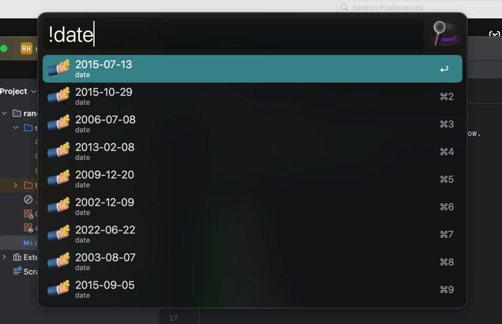

# random-helper 随机助手

A suitable for chinese bodies random helper alfred workflow.

一个适合中国宝宝的随机助手 Alfred workflow。

# 能力

- ✅生成中文名字
- ✅生成邮件
- ✅生成手机号
- ✅生成UUID
- ✅生成随机数
- ✅生成随机时间
- ✅生成随机日期
- ✅生成随机时间日期

# Version 版本
## 0.1 2024/9/26

- ✅生成中文名字
- ✅生成邮件
- ✅生成手机号
- ✅生成UUID
- ✅生成随机数
- ✅生成随机时间
- ✅生成随机日期
- ✅生成随机时间日期

# 下载
[0.1](https://github.com/PeixyJ/alfred-random-helper/releases/tag/0.1)
# 使用方法

- ✅生成中文名字 !name
- ✅生成邮件 !email
- ✅生成手机号 !phone
- ✅生成UUID !uuid
- ✅生成随机数 !number
- ✅生成随机时间 !time
- ✅生成随机日期 !date
- ✅生成随机时间日期 !datetime

